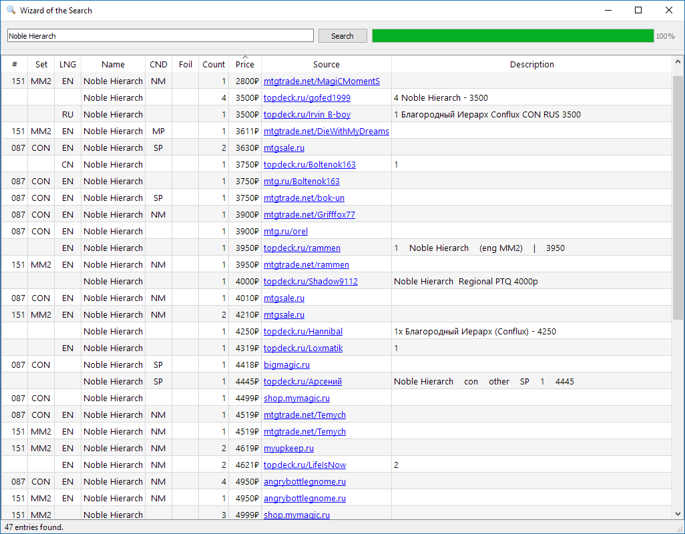

# Wizard of the Search 

Программа для поиска карт Magic the Gathering на русскоязычных торговых интернет-площадках.

Написана с использованием Python 3.6 и PyQt5.

Работает на Windows, Linux и OS X.

## Список поддерживаемых ресурсов
- [amberson.mtg.ru](http://amberson.mtg.ru/)
- [angrybottlegnome.ru](http://angrybottlegnome.ru/)
- [autumnsmagic.com](https://autumnsmagic.com/)
- [bigmagic.ru](http://bigmagic.ru/)
- [cardplace.ru](https://www.cardplace.ru/)
- [easyboosters.com](https://easyboosters.com/)
- [goodork.ru](https://goodork.ru/)
- [hexproof.ru](https://hexproof.ru/)
- [magiccardmarket.ru](http://magiccardmarket.ru/)
- [manapoint.mtg.ru](http://manapoint.mtg.ru/)
- [mtg.ru](http://www.mtg.ru/exchange/)
- [mtgsale.ru](https://mtgsale.ru/)
- [mtgshop.ru](http://mtgshop.ru/)
- [mtgtrade.net](http://mtgtrade.net/)
- [myupkeep.ru](http://myupkeep.ru/)
- [shop.mymagic.ru](https://shop.mymagic.ru/)
- [topdeck.ru](https://topdeck.ru/apps/toptrade/singles/search)

## Пример интерфейса программы

